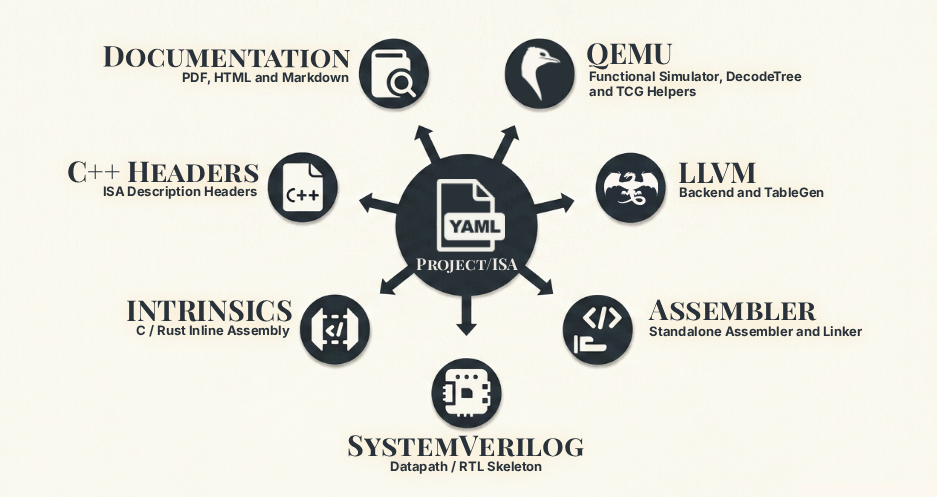

<div align="center">


**Define a processor's instruction set once in YAML - generate its entire toolchain from that single source.**

[](https://github.com/abduelturki/isa-archive/actions/workflows/ci.yml)
[](LICENSE)


[Quick start](#-quick-start) · [Tutorial](examples/tutorial/README.md) · [Docs](docs/README.md) · [Examples](#-examples) · [CLI](docs/cli.md)

</div>

ISA-Archive is a manifest-driven generator for instruction-set architectures. You describe an
ISA the way you'd describe a Kubernetes resource - `apiVersion` / `kind` / `metadata` / `spec` -
writing each instruction's encoding and a one-line behavior. From that one description it generates:

- a **QEMU** system emulator (decodetree, TCG helpers, CPU model, a virt board, build glue)
- a complete **LLVM** backend - a real `clang`/`llc` for your ISA
- a standalone **assembler** + linker script
- **SystemVerilog** datapath/RTL skeletons driven by a micro-architecture model
- **C / Rust** inline-assembly intrinsics for calling custom instructions
- standalone **C++** ISA-description headers (enums, decode, metadata) for your own models
- **Markdown / HTML / PDF** reference manuals

One YAML edit regenerates all of them, so your simulator, compiler, hardware model, and docs can
never drift apart.

<div align="center">



</div>

> **Proven end to end.** The bundled `pico32` tutorial ISA is built from an empty directory; its
> generated `clang` compiles `fib.c`, and the resulting binary runs on its generated
> `qemu-system-pico32` and prints `fib(10) = 55`.

---

## 👤 Who it's for

ISA-Archive scales from one person to a whole silicon org - the value just shifts from *doing the
work of a team* to *keeping every team in sync*.

| Audience | What you get |
|---|---|
| **Solo researcher / engineer** | One YAML file → a runnable QEMU sim, a `clang` that compiles C, an FPGA-bound RTL skeleton, and a manual - none hand-written. Change an encoding, regenerate, re-run the benchmark. |
| **Small team / startup** | A real bring-up toolchain *before* you have a compiler or DV team: QEMU as golden model, an assembler that boots silicon, an always-current manual for onboarding. |
| **Established silicon org** | The **single source of truth**: architecture owns the YAML; sim, compiler, RTL, and docs are *derived*, so teams can't drift. The [`Project`](docs/yaml/project.md) manifest makes it governed - per-output policies, one `build` for CI, `--strict` as a coverage gate. |
| **Teams with existing models** | Adopt slices, not the whole pipeline: the [`cpp-isa`](docs/yaml/types.md) headers drop one decode definition into an existing C++ performance/cycle model; C/Rust intrinsics give firmware typed wrappers. |
| **Educators & learners** | The [tutorial](examples/tutorial/README.md) builds a working 32-bit CPU from an empty directory - from "what's an opcode" to "compile and run C on your own ISA". |

---

## 📦 Install

ISA-Archive uses [uv](https://github.com/astral-sh/uv) and requires Python ≥ 3.12.

```bash
git clone https://github.com/abduelturki/isa-archive.git
cd isa-archive
uv run isa-archive --help
```

## 🚀 Quick start

```bash
# Validate a manifest (catches encoding collisions, bad field widths, typos, …)
uv run isa-archive parse examples/tutorial/pico32-part4/isa.yaml

# Generate one target into a directory
uv run isa-archive generate -i examples/tutorial/pico32-part4/isa.yaml -t qemu -o build/qemu

# Sub-targets emit just a slice
uv run isa-archive generate -i examples/tutorial/pico32-part4/isa.yaml -t llvm-tablegen -o build/td

# Generate everything at once
uv run isa-archive generate -i examples/tutorial/pico32-part4/isa.yaml -t all -o build/

# Or drive it all from a Project manifest - each target lands in its own path
uv run isa-archive build examples/tutorial/pico32-part4/project.yaml

# Scaffold a brand-new ISA to start from
uv run isa-archive init my-cpu --xlen 32 --output-dir .
```

**New here?** The [**pico32 tutorial**](examples/tutorial/README.md) builds a 32-bit CPU from an
empty directory across four parts - simulate it, write assembly loops, compile C for it, then grow
it with extensions.

### What the YAML needs

Three kinds in one file are enough to generate a simulator, an assembler, decode/encode headers, and
a manual:

```yaml
kind: ISA                                   # the root: name, data width, register files
metadata: { name: tiny }
spec:
  version: "1.0"
  xlen: 32
  state:
    registers:
      - { name: r, width: 32, count: 16 }   # at least one register file
---
kind: Schema                                # a bit-layout, shared by many instructions
metadata: { name: RType }
spec:
  length: 32                                # instruction width in bits
  fields:
    - { name: opcode, start: 0,  width: 8, role: opcode }
    - { name: rd,     start: 8,  width: 4, role: register, type: r }
    - { name: rs1,    start: 12, width: 4, role: register, type: r }
    - { name: rs2,    start: 16, width: 4, role: register, type: r }
---
kind: Instruction                           # one operation: schema + fixed bits + behavior
metadata: { name: ADD }
spec:
  schema: RType
  opcode: 0x01
  behavior: "rd = rs1 + rs2"
```

- **Required** for any output: an `ISA` (with a register file), at least one `Schema`, and the
  `Instruction`s that reference it - each with an opcode value and a one-line `behavior:`.
- **Add as you need more:** `abi:` + `machine:` to get a full QEMU board and a C compiler;
  [`Enum`](docs/yaml/types.md) / [`Constant`](docs/yaml/types.md) for named field values and opcodes;
  [`Operand`](docs/yaml/types.md) / [`ScalarType`](docs/yaml/types.md) for structured fields and
  custom element types; `state.csrs` + `trap:` for control/status registers and traps; a
  [`uArch`](docs/yaml/uarch.md) manifest (`--uarch`) for the SystemVerilog block modules.

Every field of every kind is in the [manifest reference](docs/yaml/README.md); split it across files
with `includes:` and reuse a base with `extends:`.

---

## ⚙️ How it works

An ISA is a small set of manifests that reference each other by name:

```yaml
# A bit-layout shared by many instructions
kind: Schema
metadata: { name: RType }
spec:
  length: 32
  fields:
    - { name: opcode, start: 0,  width: 7, role: opcode }
    - { name: rd,     start: 7,  width: 5, role: register, type: gpr }
    - { name: funct3, start: 12, width: 3, role: constant, type: enum.F3_ALU }
    - { name: rs1,    start: 15, width: 5, role: register, type: gpr }
    - { name: rs2,    start: 20, width: 5, role: register, type: gpr }
    - { name: funct7, start: 25, width: 7, role: constant, type: enum.F7_ALU }
---
# One instruction = a schema + fixed field values + a behavior
kind: Instruction
metadata: { name: ADD }
spec:
  schema: RType
  opcode: OP
  funct3: F3_ALU.ADD_SUB
  funct7: F7_ALU.BASE
  behavior: "rd = rs1 + rs2"
```

The `behavior` field is a small Python-like DSL. ISA-Archive parses it into an intermediate
representation and lowers it per backend: to **C/TCG** for the QEMU helper, to **SystemVerilog**
for the datapath, and to **LLVM instruction-selection patterns** for the compiler. The same field
placements drive the decoder, the assembler, and the encoder. You write the semantics once; every
backend reads from it.

### The behavior DSL

```yaml
behavior: "rd = rs1 + rs2"                       # ALU op
behavior: "rd = rs1 | (rs2 << shamt)"            # shifts, bitwise
behavior: "rd = sext(mem32[rs1 + imm])"          # sign-extended word load
behavior: "mem8[rs1 + imm] = rs2"                # byte store
behavior: |                                      # set-less-than (0/1 result)
  if signed(rs1) < signed(rs2):
      rd = 1
  else:
      rd = 0
behavior: |                                      # conditional branch (writes pc)
  if rs1 != rs2:
      pc = pc + sext({imm_12, imm_11, imm_10_5, imm_4_1, 0}, 13)
```

`{a, b, …}` is bit-concatenation (used to reassemble split immediates), `x[lo:hi]` slices, and
`sext`/`zext`/`signed` adapt to the destination width. Full grammar:
[the behavior DSL reference](docs/yaml/behavior.md).

**Validation, before any code is generated.** The loader rejects malformed manifests with a named,
located error - overlapping or out-of-range bit fields, register fields with no register file,
duplicate instruction encodings (decoder collisions), undeclared behavior variables, unknown YAML
keys, and immediate-width mismatches. The LLVM backend also emits a **compiler-coverage report**
and, with `--strict`, fails if a target profile (`c-baremetal`, `kernel-only`, …) is missing a
role it requires.

---

## 🧩 Manifest kinds

| Kind | Declares | Reference |
|---|---|---|
| `ISA` | The root: data width, register files, CSRs, ABI, machine layout, target identity, includes | [isa.md](docs/yaml/isa.md) |
| `Schema` | One instruction bit-layout, reused by many instructions | [schemas.md](docs/yaml/schemas.md) |
| `Instruction` | One operation: schema + fixed field values + behavior | [instructions.md](docs/yaml/instructions.md) |
| `Operand` | A structured value type with named bit-fields | [types.md](docs/yaml/types.md) |
| `Enum` | Named values for a field (`F3_ALU.ADD_SUB`) | [types.md](docs/yaml/types.md) |
| `Constant` | A named number (`opcode: OP`) | [types.md](docs/yaml/types.md) |
| `ScalarType` | A custom element type (sub-byte int, FP8, tf32, …) a register `type:` can name | [types.md](docs/yaml/types.md) |
| `uArch` | A micro-architecture: functional blocks with latency/count/handled exec-types | [uarch.md](docs/yaml/uarch.md) |
| `Project` | A build config: which targets to generate, and where | [project.md](docs/yaml/project.md) |

Manifests split across files (`includes:` globs) and extend each other (`extends:`), so an
extension inherits a base ISA's registers, schemas, ABI, and target identity and just adds what's new.

## 🎯 Generation targets

| Target | `-t` | Output |
|---|---|---|
| QEMU system emulator (mirrors the QEMU source tree) | `qemu` | `target/{isa}/`, `hw/{isa}/`, `configs/`, `patch_qemu.sh`, `INTEGRATE.md` |
| QEMU ISA semantics only (flat) | `qemu-isa` | decode / helpers / trans / arch / translate / cpu |
| LLVM backend (mirrors the LLVM source tree) | `llvm` | `llvm/lib/Target/{ISA}/`, `COMPILER_COVERAGE.md`, `patch_llvm.sh` |
| Standalone assembler + linker script | `asm` | `{isa}_asm.py`, `linker.ld` |
| C / Rust intrinsics + structs + CSR headers | `c` · `rust` | `{isa}_intrinsics.{h,rs}`, `{isa}_structs.*`, `{isa}_csrs.*` |
| C++ ISA-description headers (enums + decode + encode + metadata) | `cpp-isa` | `{Isa}.h`, `{Isa}Enums.h`, `{Isa}InstrInfo.h`, `{Isa}Decoder.h`, `{Isa}Encoder.h` |
| SystemVerilog datapath / RTL skeleton | `verilog` | `{isa}_operands.sv`, per-block modules, top module |
| Reference manual | `docs` | `{isa}_reference.md` / `.html` / `.pdf` |
| Everything except the full `qemu` tree and `cpp-isa` | `all` | `verilog`, `llvm`, `c`, `rust`, `docs`, `qemu-isa` |

**Parent targets have sub-targets** that emit a subset - usable with `-t` or in a Project:
`qemu` → `qemu-isa` · `qemu-machine` · `qemu-build`,
`llvm` → `llvm-tablegen` · `llvm-backend` · `llvm-mc`,
`docs` → `docs-md` · `docs-html` · `docs-pdf`.

Generated C/C++ is whitespace-clean by default and ships a `.clang-format`; pass `--clang-format`
to run clang-format at generation time.

## 🛠️ Project builds

A `Project` manifest is a checked-in build config - the ISAs/uArchs you use and a list of
`{ target, output }` entries - so a single command lands every artifact in its place. Re-running
regenerates each output; a per-entry policy (`overwrite` / `skip` / `error`) lets you freeze paths
you've hand-integrated.

```yaml
kind: Project
metadata: { name: pico32-soc }
spec:
  isas:  [ isa.yaml ]
  uarch: [ uarch.yaml ]
  generate:
    - { target: qemu,          output: build/qemu }       # full QEMU source tree
    - { target: llvm-tablegen, output: build/llvm-td }    # just the *.td files
    - { target: cpp-isa,       output: build/model }      # C++ description headers
    - { target: qemu-machine,  output: build/board, on_exist: skip }
```

```bash
uv run isa-archive build project.yaml
uv run isa-archive build project.yaml --only qemu,llvm-tablegen
```

Details: [docs/yaml/project.md](docs/yaml/project.md).

---

## 🧪 Examples

| Example | What it shows |
|---|---|
| [`examples/tutorial/`](examples/tutorial/README.md) | **pico32** - a 32-bit CPU built across four narrated parts (simulate → assembly → compile C → extend). Part 4 adds independent `extends:` layers: `mul` (hardware multiply), `fp` (float register class + hard-float ABI), `sys` (CSRs). |
| [`examples/npu-probe/`](examples/npu-probe/README.md) | A deliberately non-CPU target - big-endian, 128-bit vector and 1-bit predicate register files, a stack-less `kernel-only` profile - that demonstrates the tool's support for accelerators, not just CPUs. |

[`examples/tutorial/scripts/`](examples/tutorial/scripts/) automates the end-to-end QEMU + LLVM
build the tutorial walks through by hand.

## 📚 Documentation

Full docs live in [`docs/`](docs/README.md):

| | |
|---|---|
| [Quickstart](docs/getting-started/quickstart.md) | First success in five minutes, no toolchain builds |
| [**Tutorial**](examples/tutorial/README.md) | Build pico32 from scratch: simulate it, then compile C for it |
| [Concepts](docs/getting-started/concepts.md) | The manifest model and the generation pipeline |
| [Manifest reference](docs/yaml/README.md) | Every YAML kind, field by field, plus the [behavior DSL](docs/yaml/behavior.md) |
| [CLI reference](docs/cli.md) | Every command, flag, and target |
| [QEMU guide](docs/targets/qemu/README.md) · [Compiler guide](docs/targets/compiler/README.md) | The generated simulator and compiler, and how to build them |
| [Target guides](docs/targets/README.md) | Assembler · intrinsics · SystemVerilog · reference manuals · C++ ISA headers |
| [Developer docs](docs/development/README.md) | How it's built (architecture) and how to extend it |

## 🗂️ Project layout

```
docs/                 ← User-facing documentation (getting-started, yaml, qemu, compiler, targets)
examples/             ← pico32 tutorial (parts 1-4 + mul/fp/sys + scripts) and the npu-probe target
src/isa_archive/
  cli.py              ← Typer CLI: parse / generate / build / init
  models/             ← Pydantic manifest models (ISA, Schema, Instruction, uArch, Project, …)
  compiler/
    loader.py         ← Loads & validates manifests; load_isa / load_uarch / load_project
    behavior.py       ← The behavior DSL → intermediate representation
    backends/         ← IR → C/TCG, SystemVerilog, LLVM DAG patterns
  generators/         ← Per-target generators (qemu, llvm, asm, sv, software, docs, cpp_isa)
    targets.py        ← The target/sub-target taxonomy shared by `generate` and `build`
    templates/        ← Jinja templates per backend
tests/                ← pytest unit + integration suite
```

## 🔧 Development

```bash
uv run pytest -q                      # the full suite
uv run pytest tests/test_cpp_isa.py -q
```

See [CONTRIBUTING.md](CONTRIBUTING.md) to get started.

## ⚠️ Current limitations

ISA-Archive is **alpha (0.1.0)** - the manifest schema, CLI, and generated output may change
between versions. A guiding principle ensures predictability: generation **fails loudly** when
a manifest asks for something a backend can't model, naming the instruction - never silent wrong
output.

Every current boundary - by tool area (behavior DSL, registers, encodings, …) and by target (QEMU,
LLVM, assembler, C++ headers, intrinsics, SystemVerilog, manuals) - is consolidated in one place:

**→ [docs/limitations.md](docs/limitations.md)**

## ⚖️ License

- **Tool source:** GNU GPLv3 (see [LICENSE](LICENSE)).
- **Generated output:** owned entirely by you. Provided "as is", without warranty of any kind.
