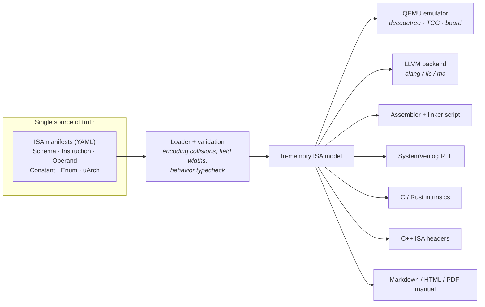

# ISA-Archive

**Define a processor's instruction set once in YAML - generate its entire toolchain from that single source.**

ISA-Archive is a manifest-driven generator for instruction-set architectures. You
describe an ISA the way you'd describe a Kubernetes resource - `apiVersion` / `kind` /
`metadata` / `spec` - writing each instruction's encoding and a one-line behavior. From
that one description ISA-Archive generates:

- a **QEMU** system emulator (decodetree, TCG helpers, CPU model, a virt board, build glue),
- a complete **LLVM** backend - a real `clang`/`llc` for your ISA,
- a standalone **assembler** + linker script,
- **SystemVerilog** datapath/RTL skeletons driven by a micro-architecture model,
- **C / Rust** inline-assembly intrinsics for calling custom instructions,
- standalone **C++** ISA-description headers (enums, decode, metadata) for your own models,
- **Markdown / HTML / PDF** reference manuals.

One YAML edit regenerates all of them, so your simulator, compiler, hardware model, and
docs can never drift apart.



> **Proven end to end.** The bundled `pico32` tutorial ISA is built from an empty
> directory; its generated `clang` compiles `fib.c`, and the resulting binary runs on its
> generated `qemu-system-pico32` and prints `fib(10) = 55`.

---

## Who it's for

ISA-Archive scales from one person to a whole silicon org - the value just shifts from
"do the work of a team" to "keep every team in sync."

**The solo researcher or engineer.** One person, a YAML file, and a complete toolchain:
a runnable QEMU simulator, an LLVM `clang` that compiles C for your ISA, an FPGA-bound
SystemVerilog skeleton, and a reference manual - none of which you hand-wrote. Change an
encoding, regenerate, re-run your benchmark: architecture exploration in minutes, and a
paper whose artifacts reviewers rebuild from the same manifest.
([`examples/npu-probe`](examples/npu-probe/README.md) is exactly this - a non-CPU
vector/predicate probe.)

**A small team or startup.** Bootstrap a real bring-up toolchain *before* you have a
compiler team or a DV team. The generated QEMU is your golden reference model, the
standalone assembler boots silicon, and the always-current manual onboards new hires -
all from the spec you were going to write anyway.

**An established silicon org.** The point here is the **single source of truth**: the
architecture team owns the YAML, and the simulator, compiler, RTL, intrinsics, and manual
are all *derived* - so the compiler team, the DV team, and the RTL team can't drift out of
sync with the spec or with each other. The [`Project`](docs/yaml/project.md) manifest makes
that a governed, checked-in process:

- per-output **policies** (`overwrite` / `skip` / `error`) freeze paths a team has
  hand-integrated while everything else regenerates;
- one `build` command (or `--only target,…`) drops into CI, so every regeneration is
  reproducible;
- `--strict` fails the build when the ISA outgrows what its compiler profile can still
  lower - a coverage gate, not a release-day surprise.

**Teams with models they already trust.** You don't have to adopt the whole pipeline. The
**`cpp-isa`** headers (enums, decode tables, instruction metadata) drop into an existing
C++ performance or cycle model so it shares one decode definition instead of a
hand-maintained copy. The **C / Rust intrinsics** give firmware teams typed wrappers for
custom instructions. Take the slices you need; leave the rest.

**Educators and learners.** The [tutorial](examples/tutorial/README.md) builds a working
32-bit CPU from an empty directory, so a course can go from "what's an opcode" to "compile
and run C on your own ISA" without a prebuilt toolchain.

---

## Install

ISA-Archive uses [uv](https://github.com/astral-sh/uv) and requires Python ≥ 3.12.

```bash
git clone https://github.com/abduelturki/isa-archive.git
cd isa-archive
uv run isa-archive --help
```

## Quick start

```bash
# Validate a manifest (catches encoding collisions, bad field widths, typos, …)
uv run isa-archive parse examples/tutorial/pico32-part4/isa.yaml

# Generate one target into a directory
uv run isa-archive generate -i examples/tutorial/pico32-part4/isa.yaml -t qemu -o build/qemu

# Sub-targets emit just a slice
uv run isa-archive generate -i examples/tutorial/pico32-part4/isa.yaml -t llvm-tablegen -o build/td

# Generate everything at once
uv run isa-archive generate -i examples/tutorial/pico32-part4/isa.yaml -t all -o build/

# Or drive it all from a Project manifest — each target lands in its own path
uv run isa-archive build examples/tutorial/pico32-part4/project.yaml

# Scaffold a brand-new ISA to start from
uv run isa-archive init my-cpu --xlen 32 --output-dir .
```

**New here?** The [**pico32 tutorial**](examples/tutorial/README.md) builds a 32-bit CPU
from an empty directory across four parts - simulate it, write assembly loops, compile C
for it, then grow it with extensions.

---

## How it works

An ISA is a small set of manifests that reference each other by name:

```yaml
# A bit-layout shared by many instructions
kind: Schema
metadata: { name: RType }
spec:
  length: 32
  fields:
    - { name: opcode, start: 0,  width: 7, role: opcode }
    - { name: rd,     start: 7,  width: 5, role: register, type: gpr }
    - { name: funct3, start: 12, width: 3, role: constant, type: enum.F3_ALU }
    - { name: rs1,    start: 15, width: 5, role: register, type: gpr }
    - { name: rs2,    start: 20, width: 5, role: register, type: gpr }
    - { name: funct7, start: 25, width: 7, role: constant, type: enum.F7_ALU }
---
# One instruction = a schema + fixed field values + a behavior
kind: Instruction
metadata: { name: ADD }
spec:
  schema: RType
  opcode: OP
  funct3: F3_ALU.ADD_SUB
  funct7: F7_ALU.BASE
  behavior: "rd = rs1 + rs2"
```

The `behavior` field is a small Python-like DSL. ISA-Archive parses it into an
intermediate representation and lowers it per backend: to **C/TCG** for the QEMU helper,
to **SystemVerilog** for the datapath, and to **LLVM instruction-selection patterns** for
the compiler. The same field placements drive the decoder, the assembler, and the
encoder. You write the semantics once; every backend reads from it.

### The behavior DSL

```yaml
behavior: "rd = rs1 + rs2"                       # ALU op
behavior: "rd = rs1 | (rs2 << shamt)"            # shifts, bitwise
behavior: "rd = sext(mem32[rs1 + imm])"          # sign-extended word load
behavior: "mem8[rs1 + imm] = rs2"                # byte store
behavior: |                                      # set-less-than (0/1 result)
  if signed(rs1) < signed(rs2):
      rd = 1
  else:
      rd = 0
behavior: |                                      # conditional branch (writes pc)
  if rs1 != rs2:
      pc = pc + sext({imm_12, imm_11, imm_10_5, imm_4_1, 0}, 13)
```

`{a, b, …}` is bit-concatenation (used to reassemble split immediates), `x[lo:hi]` slices,
and `sext`/`zext`/`signed` adapt to the destination width. Full grammar:
[the behavior DSL reference](docs/yaml/behavior.md).

### Validation, before any code is generated

The loader rejects malformed manifests with a named, located error — overlapping or
out-of-range bit fields, register fields with no register file, duplicate instruction
encodings (decoder collisions), undeclared behavior variables, unknown YAML keys
(every manifest forbids extras), and immediate-width mismatches. The LLVM backend also
emits a **compiler-coverage report** and, with `--strict`, fails if a target profile
(`c-baremetal`, `kernel-only`, …) is missing a role it requires.

---

## Manifest kinds

| Kind | Declares | Reference |
|---|---|---|
| `ISA` | The root: data width, register files, CSRs, ABI, machine layout, target identity, includes | [isa.md](docs/yaml/isa.md) |
| `Schema` | One instruction bit-layout, reused by many instructions | [schemas.md](docs/yaml/schemas.md) |
| `Instruction` | One operation: schema + fixed field values + behavior | [instructions.md](docs/yaml/instructions.md) |
| `Operand` | A structured value type with named bit-fields | [types.md](docs/yaml/types.md) |
| `Enum` | Named values for a field (`F3_ALU.ADD_SUB`) | [types.md](docs/yaml/types.md) |
| `Constant` | A named number (`opcode: OP`) | [types.md](docs/yaml/types.md) |
| `ScalarType` | A custom element type (sub-byte int, FP8, tf32, …) a register `type:` can name | [types.md](docs/yaml/types.md) |
| `uArch` | A micro-architecture: functional blocks with latency/count/handled exec-types | [uarch.md](docs/yaml/uarch.md) |
| `Project` | A build config: which targets to generate, and where | [project.md](docs/yaml/project.md) |

Manifests split across files (`includes:` globs) and extend each other (`extends:`), so an
extension inherits a base ISA's registers, schemas, ABI, and target identity and just adds
what's new.

## Generation targets

| Target | `-t` | Output |
|---|---|---|
| QEMU system emulator (mirrors the QEMU source tree) | `qemu` | `target/{isa}/`, `hw/{isa}/`, `configs/`, `patch_qemu.sh`, `INTEGRATE.md` |
| QEMU ISA semantics only (flat) | `qemu-isa` | decode / helpers / trans / arch / translate / cpu |
| LLVM backend (mirrors the LLVM source tree) | `llvm` | `llvm/lib/Target/{ISA}/`, `COMPILER_COVERAGE.md`, `patch_llvm.sh` |
| Standalone assembler + linker script | `asm` | `{isa}_asm.py`, `linker.ld` |
| C / Rust intrinsics + structs + CSR headers | `c` · `rust` | `{isa}_intrinsics.{h,rs}`, `{isa}_structs.*`, `{isa}_csrs.*` |
| C++ ISA-description headers (enums + decode + metadata) | `cpp-isa` | `{isa}_enums.h`, `{isa}_info.h`, `{isa}_decode.h`, `{isa}_model.h` |
| SystemVerilog datapath / RTL skeleton | `verilog` | `{isa}_operands.sv`, per-block modules, top module |
| Reference manual | `docs` | `{isa}_reference.md` / `.html` / `.pdf` |
| Everything except the full `qemu` tree and `cpp-isa` | `all` | `verilog`, `llvm`, `c`, `rust`, `docs`, `qemu-isa` |

**Parent targets have sub-targets** that emit a subset — usable with `-t` or in a Project:
`qemu` → `qemu-isa` · `qemu-machine` · `qemu-build`,
`llvm` → `llvm-tablegen` · `llvm-backend` · `llvm-mc`,
`docs` → `docs-md` · `docs-html` · `docs-pdf`.

Generated C/C++ is whitespace-clean by default and ships a `.clang-format`; pass
`--clang-format` to run clang-format at generation time.

## Project builds

A `Project` manifest is a checked-in build config — the ISAs/uArchs you use and a list of
`{ target, output }` entries — so a single command lands every artifact in its place.
Re-running regenerates each output; a per-entry policy (`overwrite` / `skip` / `error`)
lets you freeze paths you've hand-integrated.

```yaml
kind: Project
metadata: { name: pico32-soc }
spec:
  isas:  [ isa.yaml ]
  uarch: [ uarch.yaml ]
  generate:
    - { target: qemu,          output: build/qemu }       # full QEMU source tree
    - { target: llvm-tablegen, output: build/llvm-td }    # just the *.td files
    - { target: cpp-isa,       output: build/model }      # C++ description headers
    - { target: qemu-machine,  output: build/board, on_exist: skip }
```

```bash
uv run isa-archive build project.yaml
uv run isa-archive build project.yaml --only qemu,llvm-tablegen
```

Details: [docs/yaml/project.md](docs/yaml/project.md).

---

## Examples

| Example | What it shows |
|---|---|
| [`examples/tutorial/`](examples/tutorial/README.md) | **pico32** — a 32-bit CPU built across four narrated parts (simulate → assembly → compile C → extend). Part 4 adds independent `extends:` layers: `mul` (hardware multiply), `fp` (float register class + hard-float ABI), `sys` (CSRs). |
| [`examples/npu-probe/`](examples/npu-probe/README.md) | A deliberately non-CPU target — big-endian, 128-bit vector and 1-bit predicate register files, a stack-less `kernel-only` profile — that keeps the "works for accelerators, not just CPUs" claim honest. |

[`examples/tutorial/scripts/`](examples/tutorial/scripts/) automates the end-to-end QEMU +
LLVM build the tutorial walks through by hand.

## Documentation

Full docs live in [`docs/`](docs/README.md):

| | |
|---|---|
| [Quickstart](docs/getting-started/quickstart.md) | First success in five minutes, no toolchain builds |
| [**Tutorial**](examples/tutorial/README.md) | Build pico32 from scratch: simulate it, then compile C for it |
| [Concepts](docs/getting-started/concepts.md) | The manifest model and the generation pipeline |
| [Manifest reference](docs/yaml/README.md) | Every YAML kind, field by field, plus the [behavior DSL](docs/yaml/behavior.md) |
| [CLI reference](docs/cli.md) | Every command, flag, and target |
| [QEMU guide](docs/qemu/README.md) · [Compiler guide](docs/compiler/README.md) | The generated simulator and compiler, and how to build them |
| [Target guides](docs/targets/) | Assembler · intrinsics · SystemVerilog · reference manuals |

## Project layout

```
docs/                 ← User-facing documentation (getting-started, yaml, qemu, compiler, targets)
examples/             ← pico32 tutorial (parts 1–4 + mul/fp/sys + scripts) and the npu-probe target
src/isa_archive/
  cli.py              ← Typer CLI: parse / generate / build / init
  models/             ← Pydantic manifest models (ISA, Schema, Instruction, uArch, Project, …)
  compiler/
    loader.py         ← Loads & validates manifests; load_isa / load_uarch / load_project
    behavior.py       ← The behavior DSL → intermediate representation
    backends/         ← IR → C/TCG, SystemVerilog, LLVM DAG patterns
  generators/         ← Per-target generators (qemu, llvm, asm, sv, software, docs, cpp_isa)
    targets.py        ← The target/sub-target taxonomy shared by `generate` and `build`
    templates/        ← Jinja templates per backend
tests/                ← pytest unit + integration suite
```

## Development

```bash
uv run pytest -q          # the full suite
uv run pytest tests/test_cpp_isa.py -q
```

## License

- **Tool source:** GNU GPLv3.
- **Generated output:** owned entirely by you. Provided "as is", without warranty of any kind.
