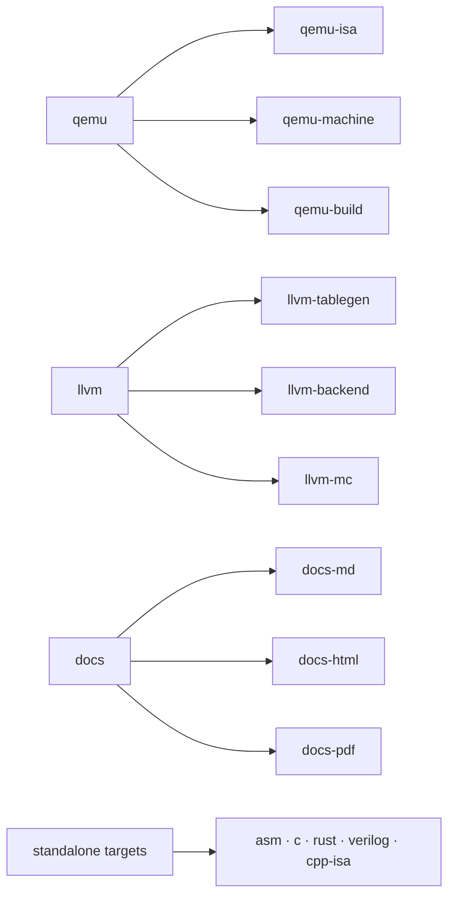

# CLI reference

The tool has four commands:

```
isa-archive init      Scaffold a new ISA project with a working example
isa-archive parse     Parse and validate manifests without generating output
isa-archive generate  Generate artifacts from manifests
isa-archive build     Generate everything a Project manifest configures, into its paths
```

`generate -t <target>` accepts parent targets and sub-targets alike
(`qemu`, `qemu-isa`, `qemu-machine`, `llvm`, `llvm-tablegen`, `docs-html`, …).
`build` runs the `{ target, output }` entries of a [`Project`](yaml/project.md)
manifest; see that page for the full target taxonomy.

## `isa-archive init`

```sh
isa-archive init NAME [--xlen N] [--output-dir DIR]
```

Creates `DIR/NAME/` with a minimal, valid, generatable ISA:

```
$ isa-archive init my-isa --xlen 32 --output-dir .
Created my-isa/ with 3 files.

  isa.yaml          - ISA root (xlen=32, 32 GPRs)
  layouts.yaml      - RType instruction schema
  instructions.yaml - ADD instruction
```

The scaffold defines one 32-register file with `zero`/`ra`/`sp` aliases, one
register-register layout, and an `ADD` instruction - enough to parse and
generate every target immediately, and the same starting point the
[tutorial](../examples/tutorial/pico32-part1/README.md) builds on.

## `isa-archive parse`

```sh
isa-archive parse PATH [--uarch FILE]... [-v|-q]
```

Loads and validates manifests without writing anything. `PATH` is an ISA
manifest file or a directory. On success it prints a summary:

```
$ isa-archive parse examples/tutorial/pico32-part4/isa.yaml
Validated examples/tutorial/pico32-part4/isa.yaml
  [pico32]  pico32 v0.4  xlen=32  8 schemas  13 instructions  0 operands  0 CSRs
```

Validation is strict - a misspelled key is an error, never silently ignored:

```
$ isa-archive parse bad.yaml
Error: 1 validation error for ISA
spec.byte_oder
  Extra inputs are not permitted [type=extra_forbidden, input_value='big', input_type=str]
```

Beyond key checking, the loader validates bit-field bounds and overlaps,
register-field widths against register counts, duplicate instruction
encodings (decoder collisions), and schema references.

## `isa-archive generate`

```sh
isa-archive generate --isa FILE [-i FILE]... -t TARGET [-o DIR]
                     [--uarch FILE]... [--format md|html|pdf|all] [--strict]
```

| Flag | Meaning |
|---|---|
| `--isa`, `-i` | ISA manifest path (repeatable) |
| `--target`, `-t` | what to generate (table below) |
| `--output`, `-o` | output directory (default `build`) |
| `--uarch`, `-u` | uArch manifest(s) - needed by `-t verilog` |
| `--format`, `-f` | documentation format for `-t docs` |
| `--strict` | fail if the LLVM backend is incomplete for the ISA's [compiler profile](targets/compiler/README.md#what-complete-means-target-profiles) |

### Targets



| Target | What you get | Guide |
|---|---|---|
| `qemu` | Complete QEMU target mirroring the QEMU source tree: `target/{isa}/` (decoder, helpers, CPU model), `hw/{isa}/virt.c` (machine), `configs/`, `patch_qemu.sh`, `INTEGRATE.md` | [QEMU guide](targets/qemu/README.md) |
| `qemu-isa` | Sub-target: just the ISA-semantics files (decoder/helpers/translator), flat in one directory | [QEMU guide](targets/qemu/README.md) |
| `qemu-machine` | Sub-target: the machine only - `hw/{isa}/virt.c` + `configs/` | [QEMU guide](targets/qemu/README.md) |
| `qemu-build` | Sub-target: the integration glue only - `patch_qemu.sh` + `INTEGRATE.md` | [QEMU guide](targets/qemu/README.md) |
| `llvm` | Complete LLVM backend: `llvm/lib/Target/{ISA}/` (TableGen + C++), `COMPILER_COVERAGE.md`, `patch_llvm.sh`, `INTEGRATE.md` | [Compiler guide](targets/compiler/README.md) |
| `llvm-tablegen` | Sub-target: just the `*.td` TableGen files | [Compiler guide](targets/compiler/README.md) |
| `llvm-backend` | Sub-target: just the C++ backend sources + CMake | [Compiler guide](targets/compiler/README.md) |
| `llvm-mc` | Sub-target: just `MCTargetDesc/` + `TargetInfo/` | [Compiler guide](targets/compiler/README.md) |
| `asm` | `{isa}_asm.py` - standalone Python assembler - and `linker.ld` | [Assembler](targets/assembler/README.md) |
| `c` | `{isa}_intrinsics.h`, `{isa}_structs.h`, `{isa}_csrs.h` | [Intrinsics](targets/intrinsics/README.md) |
| `rust` | `{isa}_intrinsics.rs`, `{isa}_structs.rs`, `{isa}_csrs.rs` | [Intrinsics](targets/intrinsics/README.md) |
| `cpp-isa` | `{isa}` C++ ISA-description headers (enums, decode, metadata) for your own models | |
| `verilog` | `{isa}_operands.sv` + per-uArch-block modules + `{uarch}_top.sv` | [Verilog](targets/verilog/README.md) |
| `docs` | `{isa}_reference.md` / `.html` / `.pdf` | [Reference manuals](targets/reference-manuals/README.md) |
| `docs-md` · `docs-html` · `docs-pdf` | Sub-targets: a single documentation format (the parent `docs` honors `--format`) | [Reference manuals](targets/reference-manuals/README.md) |
| `all` | verilog, llvm, c, rust, docs, and qemu-isa in one run | |

### How errors behave

Generation **fails loudly rather than emitting broken output**. Problems are
reported per instruction, all at once, with the instruction named:

```
Error: pico32: QEMU generation failed for 1 instruction(s):
  - instruction 'VADD': uses register file(s) vreg stored as byte arrays; ...
```

If a `generate` run succeeds, the output is structurally valid for its
toolchain. The LLVM target additionally writes `COMPILER_COVERAGE.md`
describing exactly what the generated compiler can and cannot lower - see
[reading the coverage report](targets/compiler/roles-and-coverage.md).
