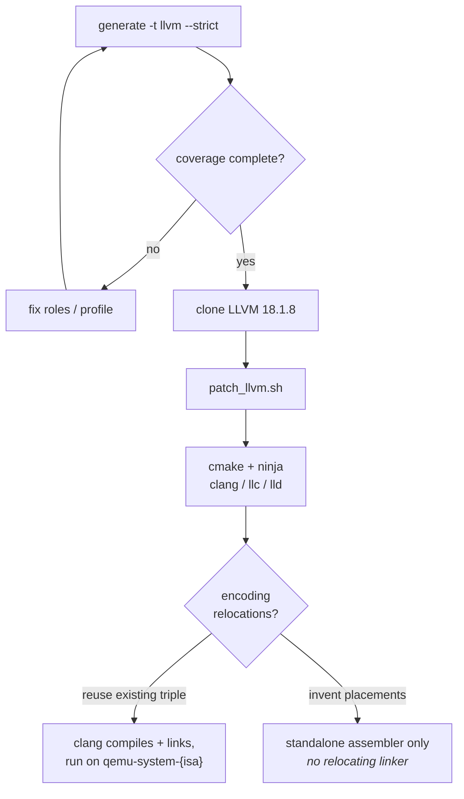

# Building and using your clang

This is the manual, understand-every-step version. The automated equivalent
for the bundled pico32 example is `bash examples/tutorial/scripts/02_build_llvm.sh`
(and `03_run_demo.sh` to compile and run programs).
[Tutorial part 3](../../examples/tutorial/pico32-part3/README.md) walks this for
an ISA you built yourself.

Prerequisites: `git`, `cmake`, `ninja`. The build is the big one-time cost:
**~40–60 minutes and ~25 GB** for a Release build of LLVM+clang with just
your target enabled. Rebuilds after ISA changes only recompile your backend -
a few minutes.



## 1. Generate - and read the report

```sh
isa-archive generate --isa my-isa/isa.yaml -t llvm -o build/llvm-gen --strict
cat build/llvm-gen/llvm/lib/Target/{ISA}/COMPILER_COVERAGE.md
```

Don't start a 40-minute build on an INCOMPLETE backend - `--strict` makes
that impossible. [How to read the report.](roles-and-coverage.md#reading-compiler_coveragemd)

## 2. Get LLVM and integrate

The generated C++ targets **LLVM 18.1.8**:

```sh
git clone --depth=1 --branch llvmorg-18.1.8 \
    https://github.com/llvm/llvm-project.git llvm-src
bash build/llvm-gen/patch_llvm.sh llvm-src
```

## 3. Configure and build

```sh
cmake -S llvm-src/llvm -B llvm-build -G Ninja \
    -DCMAKE_BUILD_TYPE=Release \
    -DLLVM_TARGETS_TO_BUILD={ISA} \
    -DLLVM_ENABLE_PROJECTS="clang;lld" \
    -DLLVM_ENABLE_ASSERTIONS=OFF \
    -DLLVM_INCLUDE_TESTS=OFF -DLLVM_INCLUDE_EXAMPLES=OFF -DLLVM_INCLUDE_DOCS=OFF
ninja -C llvm-build clang llc lld
```

`{ISA}` is your ISA name uppercased (`PICO32`). Building `lld` too gives you
a linker that needs no system toolchain.

## 4. Compile

```sh
llvm-build/bin/clang --target=riscv32-unknown-elf -march=rv32i -mabi=ilp32 \
    -nostdlib -ffreestanding -O1 -fuse-ld=lld \
    -T link.ld start.c main.c -o prog.elf
```

- `--target=` names the **triple your ISA registered under**
  (`triple_arch:` in your [ISA manifest](../yaml/isa.md#object-format-identity-triple_arch-elf_machine-)).
  Since only your backend is built into this LLVM, that triple selects *your*
  code generator.
- `-nostdlib -ffreestanding` - bare metal: no libc, your linker script.
- Inspect what your compiler did: `clang -S` for assembly in *your*
  mnemonics, or `llvm-build/bin/llc -march={isa-triple}` on LLVM IR.

The program needs a tiny runtime: an entry point that calls `main` and exits
through your machine's power switch, plus a linker script placing `.text` at
your `ram_base`. The tutorial's
[`examples/tutorial/pico32-part3/programs/`](../../examples/tutorial/pico32-part3/programs/)
has a complete, commented set (`start.c`, `link.ld`).

## Linking: the ELF reality

This is the one place where "everything from YAML" meets a hard external
fact: **linkers only understand relocations they already know.** A
relocation is the linker's instruction for patching an address into specific
bits of an instruction - and stock LLD/GNU ld ship with fixed catalogs
(R_RISCV_*, R_ARM_*, …).

So you have two honest options:

1. **Reuse an existing architecture's immediate-field placements** - then
   register under its triple (`triple_arch: riscv32`, `elf_machine: 243`)
   and its relocations patch your instructions correctly, because the bits
   live where the linker expects. Everything else (mnemonics, opcode values,
   register names, ABI, semantics) stays yours. This is the proven path: the
   tutorial's pico32 links with stock LLD this way.
2. **Invent your own placements** - generation works, the compiler works,
   `clang -c` emits objects… and no existing linker can finally link them.
   You keep: the simulator, and the
   [standalone assembler](../targets/assembler.md) (which assembles and
   places programs without a relocating linker). Relocation names that don't
   exist in the LLVM you build against will fail that LLVM build - the
   boundary shows up early, not silently.

Decide this before designing your encodings if compiled C is a goal.

## 5. Run

```sh
qemu-system-{isa} -M {isa}-virt -display none -serial stdio -monitor none \
    -bios none -kernel prog.elf
```

The same machine your [QEMU guide](../qemu/build-and-run.md) built - the
full loop: your YAML compiled your C and your YAML executes it.

## Current boundaries

- **LLVM version**: the generated C++ is written against LLVM 18.1.8's APIs.
  Other majors will likely need adjustments in the generated files (LLVM's
  internal C++ APIs change between releases) - pin 18.1.8.
- **The relocation ceiling** (above): novel encodings link only via the
  standalone assembler today.
- `-march`/`-mabi` flags follow the *triple* you registered under - for
  `riscv32` use `-march=rv32i -mabi=ilp32` regardless of your actual
  instruction set; they configure clang's driver, while code generation is
  entirely your backend.
