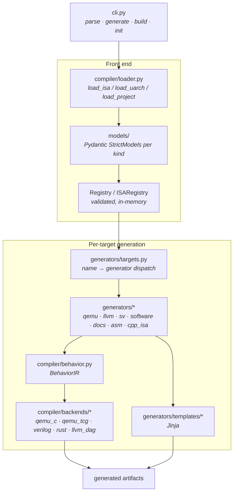

# Architecture

ISA-Archive is a linear, validated pipeline: **YAML manifests → a validated in-memory model → many
generators**, each of which lowers the one `behavior:` definition to its target language and renders
a template.



## The layers

| Layer | Where | Responsibility |
|---|---|---|
| **CLI** | `cli.py` | Typer commands `parse` / `generate` / `build` / `init`; the `-t` target list is built from `targets.TARGET_NAMES`. |
| **Models** | `models/` | One Pydantic `StrictModel` per manifest kind (`extra="forbid"`). `scalar_types.py` holds the element-type registry; `abi`/`machine`/`compiler`/`csr`/`constraint` are sub-models. |
| **Loader** | `compiler/loader.py` | `load_manifest` maps `kind:` → model; `load_isa`/`load_uarch`/`load_project` build the `Registry`; `extends`/`includes` are resolved here. `ISARegistry.validate()` runs the validation passes. |
| **Behavior IR** | `compiler/behavior.py` | `BehaviorIR` parses a `behavior:` string to a Python AST and analyzes it: used/read/written vars, bit-width inference (`get_width`), and recognizers for the DSL's namespaces (`csr_ref`, `reg_element_access`, `reg_attr_access`, trap builtins) plus flags (`modifies_pc`, `uses_sys`, `uses_structured`). |
| **Backends** | `compiler/backends/` | Lower the *same* `BehaviorIR` to each language: `qemu_c` / `qemu_tcg` (C / TCG), `verilog`, `rust`, `llvm_dag` (SelectionDAG patterns). `base._BackendBase` holds the shared expression lowering. |
| **Generators** | `generators/` | Per target: consult the registry, lower behaviors via the backends, and render Jinja templates. `base.py` provides `make_jinja_env` / `make_renderer` / `write_generated`. `targets.py` is the dispatch taxonomy (`_TARGETS`, `PARENTS`, `ALL_TARGETS`, `run_target`), shared by both `generate -t` and `build`. |
| **Templates** | `generators/templates/` | One Jinja directory per backend (`qemu`, `llvm`, `sv`, `sw`, `asm`, `cpp_isa`, `docs`) + shared `_macros.j2`. |

## One behavior, every backend

The defining principle: an instruction's semantics live in a single `behavior:` line, and each
backend *derives* its output from that one definition. `rd = rs1 + rs2` becomes a QEMU TCG op or C
helper, an LLVM `(add …)` selection pattern, and a SystemVerilog datapath - never three
hand-written copies. The same `Schema` field placements drive the decoder, assembler, and encoder.
Because everything is derived, the targets can't drift apart.

## A worked trace: `ADD`

```yaml
kind: Instruction
metadata: { name: ADD }
spec: { schema: RType, opcode: OP, funct3: F3_ALU.ADD_SUB, funct7: F7_ALU.BASE,
        behavior: "rd = rs1 + rs2" }
```

1. **Loader** resolves the fixed fields (`opcode`/`funct3`/`funct7` via the enum/constant tables),
   checks the encoding against every other instruction (decoder collisions), and validates the
   behavior's variables against the schema + register state.
2. **`build_reg_maps`** (in `compiler/utils.py`) maps `rd`/`rs1`/`rs2` to the `gpr` file and their
   widths; **`BehaviorIR`** parses `rd = rs1 + rs2`, infers widths, and records `rd` as written.
3. Each generator lowers it: **`llvm_dag`** emits `(set GPR:$rd, (add GPR:$rs1, GPR:$rs2))`;
   **`qemu_c`/`qemu_tcg`** emit the helper / TCG op; **`verilog`** emits the ALU datapath.
4. The generator renders the per-target Jinja templates into files.

## Graceful degradation

Not every construct maps to every backend. Rather than fail, a backend that can't model something
**skips or comments** it:

- QEMU/TCG falls back from the fast path to a C helper for anything non-trivial.
- The LLVM backend lists instructions it can't pattern-match as **custom-lowered** in
  `COMPILER_COVERAGE.md` (CSR/system/trap instructions, exotic shapes).
- The SystemVerilog backend emits a `// … not modeled` placeholder for CSR/trap/vector/attribute
  behaviors (gated by `BehaviorIR.uses_structured`).
- Register files the compiler can't type stay **architectural state** (simulator-only) and their
  instructions are omitted from the LLVM backend with a warning.

If generation succeeds, the output is structurally valid for that toolchain; what a backend can't
express is reported, never silently wrong.
