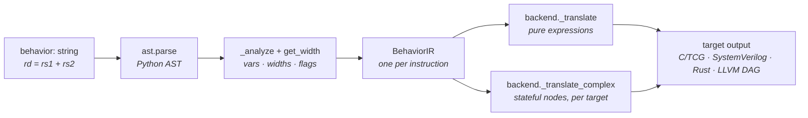

# The behavior DSL, its AST, and the backends

This page is the **internals** of an instruction's `behavior:` field - how that one line of
semantics becomes a Python AST, what `BehaviorIR` (`compiler/behavior.py`) extracts from it, and how
each backend walks that AST to emit C/TCG, SystemVerilog, Rust, or LLVM patterns. It is the
mechanism behind the project's defining rule: *one behavior, every backend.*

- Writing behaviors (the grammar you're allowed to use) → [the behavior DSL reference](../yaml/behavior.md).
- Adding a new construct → [Extending the tool](extending.md#add-a-behavior-dsl-construct).



## 1. Parsing - the DSL is a subset of Python

There is no custom parser. `BehaviorIR.__init__` calls Python's own `ast.parse(behavior_str)` and
keeps the tree; a `SyntaxError` is re-raised as a located `ValueError`. The "DSL" is therefore
whatever subset of Python syntax the backends know how to lower. The statement forms that mean
something:

| Form | Example |
|---|---|
| Assignment | `rd = rs1 + rs2` |
| Augmented assignment | `rd += imm` |
| `if` / `else` | `if rs1 != rs2: pc = pc + imm` |
| `for … in range(…)` | `for i in range(4): vd[i] = vs1[i] + vs2[i]` |
| Call statement (system primitives) | `trap(cause)` · `trap_return()` |

Everything else is an **expression**: arithmetic/bitwise/shift (`+ - * / % << >> & | ^ ~`),
comparisons and booleans, bit-slicing `x[lo:hi]`, bit-concatenation `{a, b, …}`, memory
`memNN[addr]`, the `csr.*` namespace, register-element indexing `vd[i]`, register attributes
`reg.attr`, and the cast builtins `sext` / `zext` / `signed`.

## 2. What `BehaviorIR` extracts (`_analyze`)

`_analyze()` makes **two passes** over `ast.walk(self.tree)`:

1. **Pre-pass** - classify the things that must *not* be treated as ordinary variables: `csr.*`
   references, `trap(...)` / `trap_return()` calls (and their cause arguments), shaped-register
   element accesses, and `reg.attr` accesses. Doing this first means the main pass won't record the
   `csr` namespace word, a trap cause name, or an attribute name as a variable.
2. **Main pass** - collect variable reads/writes, `for`-loop counters and intermediate
   (temporary) variables, and detect PC writes.

The results are exposed as attributes/properties the generators read:

| Member | Meaning |
|---|---|
| `used_vars` / `read_vars` / `write_vars` | Every `Name` referenced, and the load/store split (a `Name` in `Store` context is a write). Element writes `vd[i] = …` mark the base register (`vd`) written. |
| `temporaries` | `{name: (width, type)}` for names introduced inside the behavior - `for` counters (`(32, "_inline_")`) and intermediate assignments; `type` is the Operand-struct name when the value is a constructor call. |
| `modifies_pc` | An assignment to `pc`, or any `trap()`/`trap_return()` call. |
| `is_unconditional_jump` | A **top-level** `pc = …` or trap call (vs. one nested in an `if`) - i.e. control always leaves. |
| `reads_csr` / `writes_csr` / `csrs_used` | Whether any `csr.*` is read/written, and the set of CSR names touched. |
| `uses_trap` / `trap_causes_used` | Whether a trap primitive is used, and the cause names passed to `trap(...)`. |
| `attr_regs` / `unknown_reg_attrs` | Register operands accessed as `reg.attr`; and `(reg, attr)` pairs where `attr` isn't a declared attribute (the loader rejects these). |
| `uses_shaped_elem` | The behavior indexes a shaped register element (`vd[i]`). |

Two derived properties drive **graceful degradation** - backends that can't model system or
structured state check them instead of emitting wrong code:

- `uses_sys` = touches a CSR, a trap primitive, or a register attribute. (QEMU's TCG fast path falls
  back to a C helper; the LLVM backend custom-lowers; SystemVerilog comments out.)
- `uses_structured` = `uses_sys` **or** a shaped-register element. (The RTL skeleton can't model any
  of these yet.)

## 3. Width inference (`get_width`)

`get_width(node)` returns a node's bit-width by recursion - this is how the backends know how many
bits to mask, how far to sign-extend, and whether an assignment fits its target:

| Node | Width |
|---|---|
| `Constant` | `value.bit_length()` (min 1) |
| `Name` | `MEM_KEYWORDS[id]`, else `var_widths[id]`, else the operand's `spec.width` |
| `BinOp` | `max(width(left), width(right))` - the wider operand dominates |
| `x[lo:hi]` (`Slice`) | `hi - lo` |
| `{a, b, …}` (`Set`) | `sum` of element widths (bit-concatenation) |
| `Compare` / `BoolOp` | `1` (a boolean) |
| `signed(x)` | `width(x)`; `sext(…)` / `zext(…)` | the assignment-target width (else `pc` width) |
| `csr.X` / `csr.X.field`, `reg.attr`, struct `tmp.field` | the declared CSR / attribute / field width |
| `Assign` | the width of its target |

`var_widths` is seeded from the schema fields, every register file (and its ABI aliases), the CSRs,
and `pc` (= `xlen`). Sign/zero extension is **context-sensitive**: when lowering an assignment a
backend sets `_cast_width` to the target's width, so `rd = sext(mem32[…])` extends to `rd`'s width,
not a fixed 32/64.

## 4. The recognizers - classifying one node

A bare `Name`, `Subscript`, or `Attribute` is ambiguous, so `BehaviorIR` has small recognizer
methods, each matching a specific AST shape. They are the single place each namespace is understood
(the loader and every backend call the same ones):

| Recognizer | Matches | AST shape |
|---|---|---|
| `csr_ref(node)` *(static)* | `csr.X`, `csr.X.field` | `Attribute(value=Name("csr"))` / `Attribute(value=Attribute(value=Name("csr")))` |
| `reg_element_access(node)` | `vd[i]`, `vd[i][j]` | chained `Subscript` whose slice is **not** a `Slice`, base `Name` in `register_map` and a shaped file |
| `reg_attr_access(node)` | `reg.attr` | `Attribute(value=Name)` where the name's file declares `attr` |
| trap builtins | `trap(cause)`, `trap_return()` | `Call(func=Name in TRAP_BUILTINS)` |
| bit-concatenation | `{a, b}` | `ast.Set` |
| bit-slice | `x[lo:hi]` | `Subscript(slice=ast.Slice)` |
| memory | `mem8/16/32/64[addr]` | `Subscript(value=Name in MEM_KEYWORDS)` |

**Disambiguation order** - how the same `Name`/`Subscript`/`Attribute` resolves, most specific
first:

1. shaped-register **element** (`reg_element_access` matches) →
2. register **attribute** (`reg_attr_access`) →
3. **CSR** (`csr_ref`) →
4. **memory** (name in `MEM_KEYWORDS`) →
5. **register operand** (name in `register_map`) →
6. **temporary** (name in `temporaries`) →
7. **immediate / constant** (an integer literal) →
8. **operand struct** (name is an Operand constructor).

A bit-slice `rd[lo:hi]` and a memory access `mem32[addr]` deliberately do **not** count as element
accesses (the first uses an `ast.Slice`; the second a `MEM_KEYWORDS` base), which is why
`reg_element_access` checks for those.

## 5. Where the IR's inputs come from

`BehaviorIR(behavior_str, register_map, var_widths, operands, csrs, regfile_shapes, regfile_attrs)`
is fed by helpers in `compiler/utils.py`:

| Argument | Built by | Contents |
|---|---|---|
| `register_map`, `var_widths` | `build_reg_maps(schema, isa_reg)` | schema field → register-file name, and name → bit-width |
| `csrs` | `csr_map(isa_reg)` | CSR name → model (for `csr.*` widths/fields) |
| `regfile_shapes` | `build_regfile_shapes(isa_reg)` | shaped file → `(element type, [dims])` |
| `regfile_attrs` | `build_regfile_attrs(isa_reg)` | file → `{attr: width}` |
| `operands` | the registry | Operand structs (for `struct.field` widths) |

These are constructed in two places: the loader's `ISARegistry._validate_instructions()` (which
builds an IR for every instruction at load time to prove the behavior is well-formed - see
[the call chain](architecture.md#what-runs-when-the-generate-call-chain)), and each generator's
per-instruction info builder (e.g. `qemu/semantics.py`, `cpp_isa._instr_info`).

## 6. How a backend walks the AST

Backends share `_BackendBase` (`compiler/backends/base.py`). Its `_translate(node)` lowers the
**pure, target-neutral** expression nodes itself and routes everything **stateful** to a per-backend
hook:

- Handled in the base class: `BinOp`, `Compare`, `BoolOp`, `UnaryOp`, `Constant`, and a plain
  `Attribute` - these map to identical C-like operator strings everywhere. (`OPERATORS`, `CMP_OPS`,
  `BOOL_OPS` are the operator tables.)
- Routed to `_translate_complex(node)`: `Name`, `Subscript`, `Call`, `Assign`, `AugAssign`, `If`,
  `For`, and the `csr.*` / `reg.attr` attribute forms - because *where the state lives* differs per
  target. The base `_translate_complex` just raises, so each backend overrides it.

A concrete `qemu_c` lowering:

```text
rd = rs1 + rs2     →  the Assign target rd is a register operand → env->gpr[rd] = (gpr_rs1 + gpr_rs2);
mem32[rs1+imm]=rs2 →  Subscript over a MEM_KEYWORD → cpu_stl_data_ra(env, (gpr_rs1 + imm), gpr_rs2, GETPC());
```

`_translate` emits the `rs1 + rs2` `BinOp`; `_translate_complex` handles the `Assign`, the register
`Name`s (env-> vs. a TCG-global temp), and the `mem32[...]` store.

Not every backend lowers to a string. `llvm_dag` **classifies** the same IR instead: it reads
`ir.modifies_pc`, `ir.is_unconditional_jump`, and walks `ir.tree.body` to decide whether an
instruction is an ALU op, a branch (and which `setcc` condition), a load/store, etc., and returns a
SelectionDAG pattern. Same IR, two very different consumers - which is exactly why the analysis and
the lowering are kept separate.
