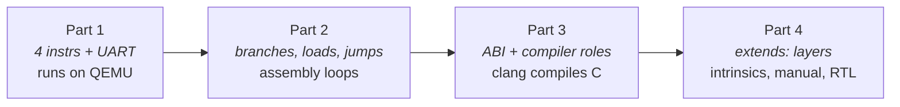

# Examples tour

`examples/` holds two ISAs, each making a different point. Use this map to
find the one closest to what you're building.

| Example | What it demonstrates |
|---|---|
| `tutorial/pico32-part1…4` | The [tutorial](../examples/tutorial/README.md): a 32-bit CPU built from an empty directory - simulator, assembler, C compiler, manual, RTL - **build-validated end to end** |
| `tutorial/pico32-part4/mul` | Extending a base ISA with `extends:` - a hardware multiply |
| `tutorial/pico32-part4/fp` | A second register class (integer + `f32` float) and a hard-float calling convention |
| `tutorial/pico32-part4/sys` | Control/status registers with field access modes |
| `npu-probe` | An accelerator-style ISA: `kernel-only` profile, big-endian, 128-bit vector registers with working arithmetic, 1-bit predicates, no stack/ABI |

## pico32 - the from-scratch CPU



The main path. The [tutorial](../examples/tutorial/README.md) grows pico32
across four parts - multi-file layout (`schemas.yaml`, `constants.yaml`,
`instructions/*.yaml`), every field role, an explicit ABI, a QEMU machine
block, and a generated clang that compiles C running on the generated QEMU.
Each part's finished state is checked in beside its `README.md`. Diff your work
against them when something misbehaves:

```sh
isa-archive parse examples/tutorial/pico32-part3/isa.yaml
diff -r my-pico32/ examples/tutorial/pico32-part3/
```

The end-to-end QEMU + LLVM build is scripted under
[`examples/tutorial/scripts/`](../examples/tutorial/scripts/):

```sh
bash examples/tutorial/scripts/01_build_qemu.sh   # ~15 min: YAML → qemu-system-pico32
bash examples/tutorial/scripts/02_build_llvm.sh   # ~40 min: YAML → clang
bash examples/tutorial/scripts/03_run_demo.sh     # compile fib.c, run it
```

## pico32 extension layers

Part 4's base hosts several independent `extends:` layers - one ISA, many
add-ons, no forking:

- **[`mul/`](../examples/tutorial/pico32-part4/mul/)** - a hardware
  multiply inferred straight from `rd = rs1 * rs2`.
- **[`fp/`](../examples/tutorial/pico32-part4/fp/README.md)** - single-precision
  floating point: a second (`f32`) register class, FADD/FSUB/FMUL/FLW/FSW, and
  a hard-float calling convention. The case that exercises multiple register
  classes and float lowering.
- **[`sys/`](../examples/tutorial/pico32-part4/sys/README.md)** -
  control/status registers (`mstatus`, `mtvec`, counters …) with `ro`/`rw`
  field access, flowing into the QEMU CPU state and the reference manual.

## npu-probe - the not-a-CPU

What the tool does when your target *isn't* a C-running CPU: `profile:
kernel-only` (COMPILER-COMPLETE with no stack, no calls), big-endian, 128-bit
vector adds that run in the simulator, 1-bit predicate registers, and an
alias-less register file. Its [README](../examples/npu-probe/README.md)
states which boundary each feature exercises.
