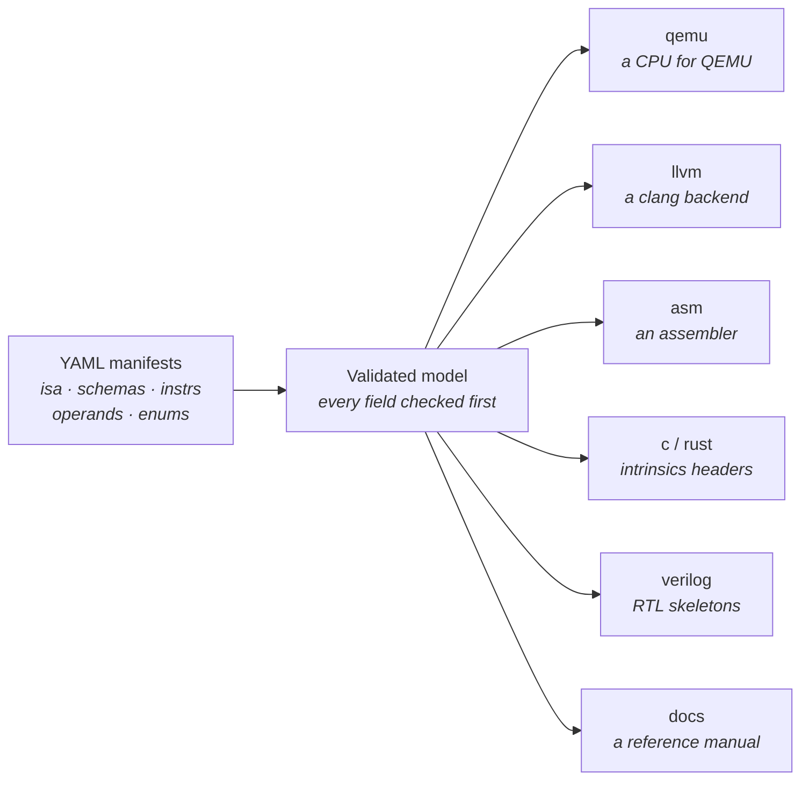

# Concepts

## The pipeline



You describe the *architecture* once; each generator derives its own view of
it. Nothing is hand-maintained per target.

## The manifest kinds

An ISA project is a set of YAML documents, each with a `kind`:

- **ISA** - the root. Names the ISA, sets the data width (`xlen`) and byte
  order, declares the register files and CSRs, the ABI, the machine layout
  for QEMU, and pulls in everything else via `includes:` globs. One per ISA
  (another ISA can `extends:` it).
- **Schema** - a bit layout: which bits are the opcode, which name a register,
  which hold an immediate. Many instructions share one schema (think "R-type").
- **Instruction** - one operation: which schema, what fixed values fill the
  opcode/function fields, and a `behavior:` describing what it does.
- **Operand** - a structured value type (bit-fields within a register or
  immediate), usable from behaviors like a struct.
- **Enum** / **Constant** - named values, so `funct3: F3_BRANCH.BEQ` replaces
  magic numbers.
- **uArch** - a micro-architecture (functional units, latencies) layered *on
  top of* an ISA; consumed by the Verilog generator. The same ISA can have
  several.

They reference each other by name: an Instruction names its Schema; a Schema
field names a register file (`type: gpr`) or an enum (`type: enum.F3_ALU`);
an Instruction's `opcode: STORE` names a Constant. The
[manifest reference](../yaml/README.md) covers every field of every kind.

## One behavior, many consumers

The heart of each instruction is one line (or a few) of Python-like code:

```yaml
behavior: "rd = rs1 + rs2"
```

That single line becomes, depending on the generator:

- a **QEMU helper** (`env->gpr[rd] = rs1_val + rs2_val;`) or a direct JIT op,
- an **LLVM selection pattern** (`(set GPR:$rd, (add GPR:$rs1, GPR:$rs2))`),
- **SystemVerilog** datapath logic,
- a line in the **reference manual**.

Because one source feeds four consumers, the language is strict: every
expression has a known bit width, and width mismatches or unsupported
constructs are generation-time errors naming the instruction - never silently
wrong code in one of the four outputs. See [the behavior DSL](../yaml/behavior.md).

## What "the compiler is complete" means

A simulator can execute *any* behavior. A C compiler needs more: it must know
which instruction adds, which one loads 32 bits, which one is the stack-pointer
adjustment, and which registers hold arguments. Two mechanisms provide this:

- **Compiler roles** - tags like `alu_rr.add` or `frame.sp_adjust`, mostly
  *inferred from the behavior automatically*, occasionally declared by hand.
- **A target profile** - the ISA declares what its compiler is *for*:
  `c-baremetal` (compile freestanding C - the default), `kernel-only`
  (a compute accelerator: no stack, no calls, nothing required), or `custom`.

Every `-t llvm` run writes a `COMPILER_COVERAGE.md` scorecard telling you
exactly what your ISA can lower and what's missing. The
[roles & coverage guide](../compiler/roles-and-coverage.md) explains how to
read it; [part 3 of the tutorial](../../examples/tutorial/pico32-part3/README.md)
walks the whole journey from "simulates" to "compiles C".
