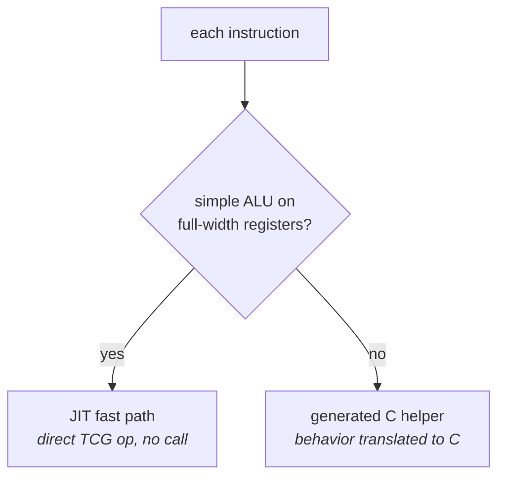
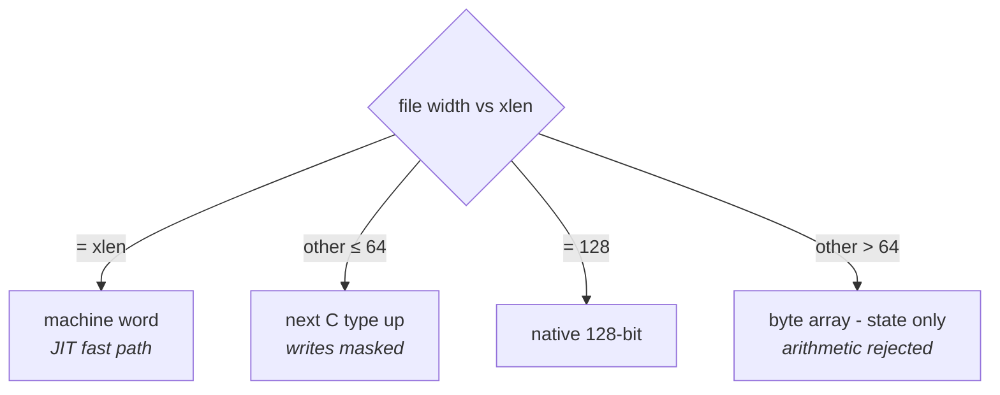

# QEMU: the generated simulator

`-t qemu` turns your YAML into a complete QEMU system-emulation target - a
`qemu-system-{isa}` binary that boots your machine and runs your programs.
This page explains what's generated and how the model works;
[build-and-run.md](build-and-run.md) walks the actual build.

## What `-t qemu` produces

The output mirrors the QEMU source tree, so integration is a copy plus one
script:

```
build/
  target/{isa}/          → drop into $QEMU/target/{isa}/
    {isa}.decode           decode patterns, one per instruction
    {isa}_helpers.c        one C function per instruction (from behavior:)
    {isa}_trans.c.inc      per-instruction translation (JIT fast path or helper call)
    {isa}_translate.c      the fetch→decode→translate loop
    {isa}_arch.h           CPU state: pc + your register files + CSRs
    {isa}_cpu.c, cpu.h, …  CPU model boilerplate, build files
  hw/{isa}/virt.c        → your machine: RAM, reset vector, declared devices
  configs/               → build-system config for the new target
  patch_qemu.sh          → one-shot integration script
  INTEGRATE.md           → step-by-step instructions
```

Sub-targets emit just a slice of the above - useful when you maintain your own
QEMU integration:

- `-t qemu-isa` - only the ISA-semantics files (decoder/helpers/translator),
  flat in one directory, no machine or build plumbing.
- `-t qemu-machine` - only the machine: `hw/{isa}/virt.c` + `configs/`.
- `-t qemu-build` - only the integration glue: `patch_qemu.sh` + `INTEGRATE.md`.

## How execution works

QEMU translates guest instructions to host code (TCG). For each of your
instructions the generator picks one of two paths automatically:

1. **Fast path** - simple ALU ops on full-width registers become direct JIT
   operations, no function call.
2. **Helper** - everything else calls a generated C function containing your
   `behavior:` translated to C. Memory accesses go through QEMU's normal
   load/store machinery, so the MMU, watchpoints, and `gdb` all work.



Branches track fall-through automatically; writes to a `zero_register` index
are discarded; schema/instruction `constraints:` become decode-time checks
that reject the instruction as illegal (logged with your message).

## How register files are stored

Each register file is modeled according to its width relative to `xlen`:

| File width | Storage | Behavior arithmetic |
|---|---|---|
| = xlen | machine words, JIT fast path eligible | full speed |
| other ≤ 64 | next C type up, writes masked to the declared width | supported (helper) |
| exactly 128 | native 128-bit integers | supported (helper) |
| other > 64 | byte arrays (state only) | **rejected loudly** |



So a 1-bit predicate file, a 16-bit register file on a 32-bit ISA, and a
128-bit vector file all simulate correctly - `examples/npu-probe` exercises
all three.

## Data widths: xlen 8 through 128

QEMU itself only has 32- and 64-bit machine words, so the generator maps your
`xlen` onto one:

- **8/16** - emulated over a 32-bit word (the same technique QEMU's AVR
  target uses): the PC, branch targets, and memory addresses are masked to
  your width; your `machine:` layout must fit in `2^xlen` bytes.
- **32/64** - direct.
- **128** - registers and arithmetic are true 128-bit; the PC and addresses
  are 64-bit (QEMU has no 128-bit addresses - same shape as real 128-bit
  designs, where data is wider than the address space).

## Endianness, floating point, exceptions

- `byte_order: big` makes the whole target big-endian (config flag +
  byte-swapped loads/stores/fetch).
- Float register files (`type: f32`/`f64`) compute with real host float
  arithmetic.
- Software traps are modeled when the ISA declares a [`trap:` block](../yaml/isa.md):
  `trap()` / `trap_return()` behaviors save the PC, set the cause, and jump through
  the trap vector (see [the behavior DSL](../yaml/behavior.md#csrs-and-traps)). There
  is no *hardware* interrupt delivery yet - an unhandled guest exception (e.g. an
  illegal instruction not routed through `trap()`) halts the CPU and, with
  `-d guest_errors`, logs `unhandled exception N at pc=0x… - CPU halted`. A pending
  power-off still completes.

## Current boundaries

- **Instruction words are capped at 64 bits** in the simulator (the compiler
  side accepts up to 512). Wider encodings fail with:
  `instruction width 128 exceeds the 64-bit limit. The QEMU backend fetches
  one instruction word per translation step…`
- **Arithmetic on >64-bit registers** works only for exactly-128-bit files;
  a 256-bit file is state-only and behaviors touching it are rejected with
  the instruction named.
- **16-bit floats (f16/bf16) and f128** have no native host arithmetic; float
  math on them is rejected (the message points at the gap).
- **One flat address space** - `mem*[...]` always targets system memory;
  separate scratchpad memories aren't expressible yet.
- **Functional only** - no cycle counts, caches, or pipeline timing. The
  [uArch manifest](../yaml/uarch.md) feeds the Verilog generator, not QEMU.
- Each ISA change needs a QEMU rebuild - but incremental builds are seconds
  (see [build-and-run.md](build-and-run.md)).
