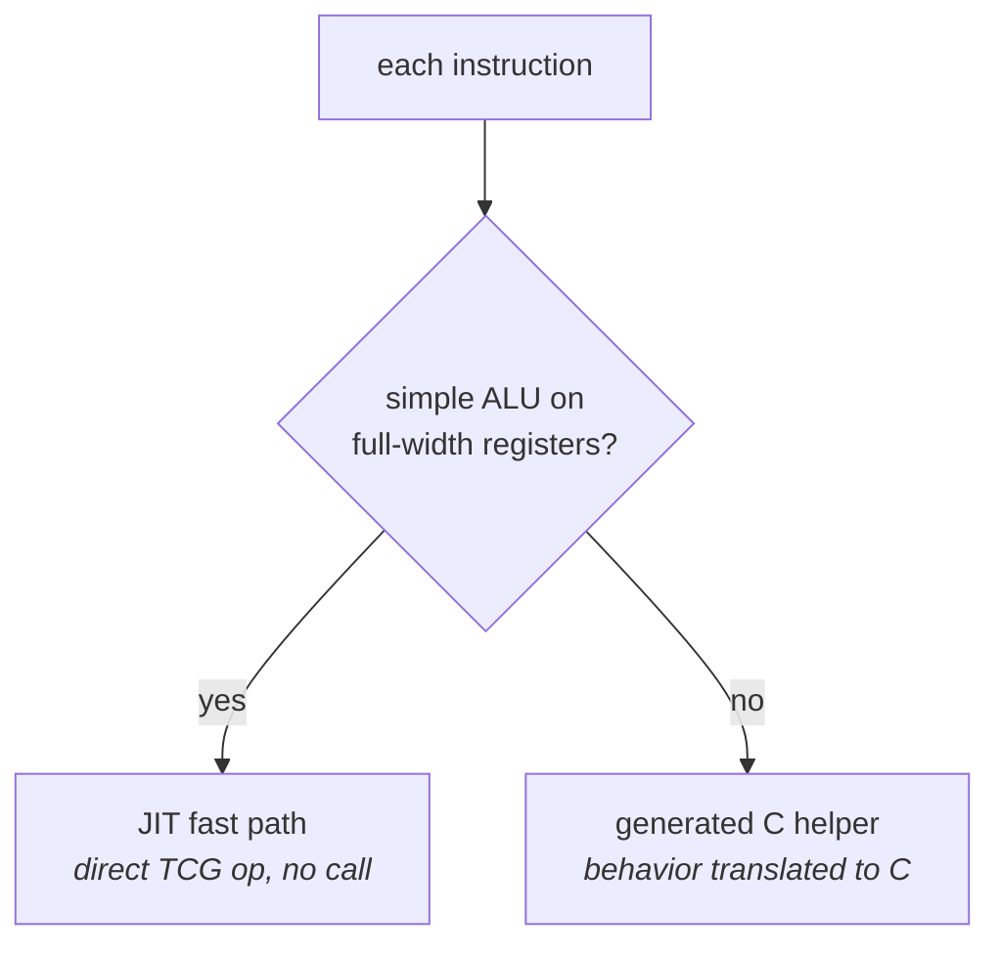
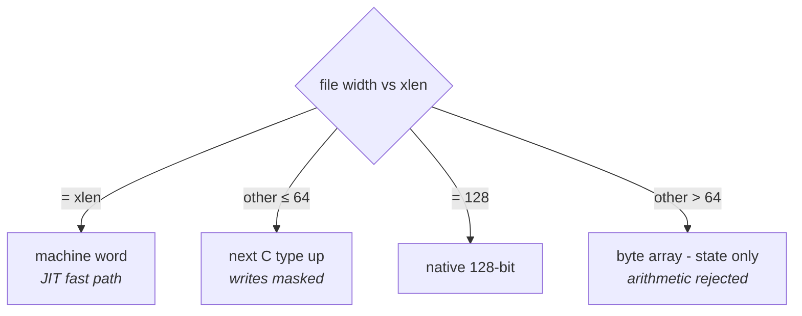

# QEMU: the generated simulator

`-t qemu` turns your YAML into a complete QEMU system-emulation target - a
`qemu-system-{isa}` binary that boots your machine and runs your programs.
This page explains what's generated and how the model works;
[build-and-run.md](build-and-run.md) walks the actual build.

## Files generated

The output mirrors the QEMU source tree, so integration is a copy plus one script. The files group
by sub-target (`-t qemu` emits all of them; the slices below emit one group each).

**ISA semantics** (`-t qemu-isa`; in `target/{isa}/` under the full tree):

| File | Purpose |
|---|---|
| `{isa}.decode` | decodetree patterns, one per instruction (≤64-bit ISAs) |
| `decode-{isa}.c.inc` | hand-written byte-array decoder (emitted *instead* of `{isa}.decode` for >64-bit instruction words) |
| `{isa}_helpers.c` | one C helper per instruction, lowered from `behavior:` (the `mem*`/`sext`/float runtime) |
| `{isa}_helper.h` | declarations of those TCG helpers |
| `{isa}_trans.c.inc` | per-instruction translation - inline TCG fast path or helper call |
| `{isa}_translate.c` | the fetch → decode → translate loop |
| `{isa}_arch.h` | CPU state: `pc` + your register files + CSRs |
| `{isa}_cpu.c` | CPU model: reset, interrupt vectoring, QOM registration |
| `{isa}_operands.h` | operand structs (only when the ISA declares Operands) |

A `.clang-format` (QEMU house style) is also written at the **output root**.

**CPU / QOM glue** (`-t qemu` `isa` component, in `target/{isa}/`):

| File | Purpose |
|---|---|
| `cpu.h` · `cpu-qom.h` · `cpu-param.h` | CPU class, QOM type macros, CPU parameters (word size, page bits) |
| `helper.h` | helper registration for decodetree |
| `meson.build` · `Kconfig` | build wiring for the target |

**Machine** (`-t qemu-machine`, in `hw/{isa}/` + `configs/`):

| File | Purpose |
|---|---|
| `hw/{isa}/virt.c` | the "virt" board: RAM, reset vector, your declared devices (UART, test/exit, `irq_test`) |
| `hw/{isa}/meson.build` · `hw/{isa}/Kconfig` | build wiring for the machine |
| `configs/targets/{isa}-softmmu.mak` | target build config |
| `configs/devices/{isa}-softmmu/default.mak` | enabled-devices config |

**Integration** (`-t qemu-build`, at the output root):

| File | Purpose |
|---|---|
| `patch_qemu.sh` | one-shot script that copies the files into a QEMU checkout and wires them up |
| `INTEGRATE.md` | step-by-step manual integration instructions |

## How execution works

QEMU translates guest instructions to host code (TCG). For each of your
instructions the generator picks one of two paths automatically:

1. **Fast path** - simple ALU ops on full-width registers become direct JIT
   operations, no function call.
2. **Helper** - everything else calls a generated C function containing your
   `behavior:` translated to C. Memory accesses go through QEMU's normal
   load/store machinery, so the MMU, watchpoints, and `gdb` all work.

Branches track fall-through automatically; writes to a `zero_register` index
are discarded; schema/instruction `constraints:` become decode-time checks
that reject the instruction as illegal (logged with your message).

## How register files are stored

Each register file is modeled according to its width relative to `xlen`:

| File width | Storage | Behavior arithmetic |
|---|---|---|
| = xlen | machine words, JIT fast path eligible | full speed |
| other ≤ 64 | next C type up, writes masked to the declared width | supported (helper) |
| exactly 128 | native 128-bit integers | supported (helper) |
| other > 64 | byte arrays (state only) | **rejected loudly** |

So a 1-bit predicate file, a 16-bit register file on a 32-bit ISA, and a
128-bit vector file all simulate correctly - `examples/npu-probe` exercises
all three.

## Data widths: xlen 8 through 128

QEMU itself only has 32- and 64-bit machine words, so the generator maps your
`xlen` onto one:

- **8/16** - emulated over a 32-bit word (the same technique QEMU's AVR
  target uses): the PC, branch targets, and memory addresses are masked to
  your width; your `machine:` layout must fit in `2^xlen` bytes.
- **32/64** - direct.
- **128** - registers and arithmetic are true 128-bit; the PC and addresses
  are 64-bit (QEMU has no 128-bit addresses - same shape as real 128-bit
  designs, where data is wider than the address space).

## Endianness, floating point, exceptions

- `byte_order: big` makes the whole target big-endian (config flag +
  byte-swapped loads/stores/fetch).
- Float register files (`type: f32`/`f64`) compute with real host float
  arithmetic.
- Software traps are modeled when the ISA declares a [`trap:` block](../../yaml/isa.md):
  `trap()` / `trap_return()` behaviors save the PC, set the cause, and jump through
  the trap vector (see [the behavior DSL](../../yaml/behavior.md#csrs-and-traps)). There
  is no *hardware* interrupt delivery yet - an unhandled guest exception (e.g. an
  illegal instruction not routed through `trap()`) halts the CPU and, with
  `-d guest_errors`, logs `unhandled exception N at pc=0x… - CPU halted`. A pending
  power-off still completes.

## Current boundaries

This project's boundaries are consolidated in one place - see [Limitations](../../limitations.md#qemu-emulator).
