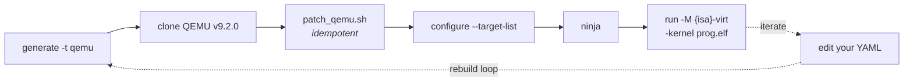

# Building and running your simulator

This is the manual, understand-every-step version. The automated equivalent
for the bundled pico32 example is `bash examples/tutorial/scripts/01_build_qemu.sh` -
same steps, scripted. [Tutorial part 1](../../../examples/tutorial/pico32-part1/README.md)
walks this for an ISA you build yourself.

Prerequisites: `git`, `meson`, `ninja` (macOS: `brew install meson ninja`).
First build ~15 minutes and ~2 GB; rebuilds after ISA changes are seconds.



## 1. Generate

```sh
isa-archive generate --isa my-isa/isa.yaml -t qemu -o build/qemu-gen
```

Read the generated `INTEGRATE.md` - it lists exactly what the next step will
do to the QEMU tree.

## 2. Get QEMU and integrate

The generated code targets **QEMU v9.2.0**:

```sh
git clone --depth=1 --branch v9.2.0 https://github.com/qemu/qemu.git qemu-src
bash build/qemu-gen/patch_qemu.sh qemu-src
```

`patch_qemu.sh` copies `target/{isa}/`, `hw/{isa}/`, and `configs/` into the
tree and applies the few one-line registrations QEMU needs (it's idempotent -
rerun it after every regeneration).

## 3. Configure and build

```sh
mkdir qemu-build && cd qemu-build
../qemu-src/configure --target-list={isa}-softmmu \
    --disable-docs --disable-werror \
    --extra-cflags="-Wno-unused-function -Wno-unused-variable"
ninja -j$(nproc)
```

You now have `qemu-build/qemu-system-{isa}`.

**The rebuild loop** after changing your YAML:

```sh
isa-archive generate --isa my-isa/isa.yaml -t qemu -o build/qemu-gen
bash build/qemu-gen/patch_qemu.sh qemu-src
ninja -C qemu-build          # incremental - seconds
```

## 4. Run a program

The machine comes from your ISA's [`machine:` block](../../yaml/isa.md#machine--the-qemu-machine):
RAM at `ram_base`, execution starting at the reset vector, plus your devices.
It loads ELF files via `-kernel`:

```sh
qemu-system-pico32 -M pico32-virt -display none -serial stdio -monitor none \
    -bios none -kernel hello.elf
```

- `-M {isa}-virt` - your generated machine.
- `-serial stdio` - the `ns16550` UART becomes your terminal: every byte the
  program stores to the UART base address appears here.
- `-kernel` - an ELF (from the [generated assembler](../assembler/README.md)
  with `--elf`, or from [your generated clang](../compiler/build-and-use.md)).

**Exiting**: with a `sifive_test` device declared, the program writes `0x5555`
to its base address and QEMU exits with status 0 (`0x3333` → failure). Make
that write the program's *last action* (or spin afterwards) - see the
[tutorial](../../../examples/tutorial/pico32-part1/README.md#run-it) for the idiom.

## Debugging your ISA

| Tool | What it shows |
|---|---|
| `-d in_asm` | each guest instruction as it's translated - *is my encoding decoded as the instruction I meant?* |
| `-d in_asm,op` | plus the JIT ops it became - *is the behavior what I wrote?* |
| `-d guest_errors` | constraint rejections, illegal instructions, unhandled exceptions with PC |
| `-s -S` | gdb stub: connect `gdb` / `lldb` to port 1234, single-step your CPU |

A program that prints nothing and exits oddly usually fetched zeros after
running off its own end - check that it ends with the power-off write or an
infinite loop, and run with `-d guest_errors`.

## Troubleshooting

- **`configure` can't find the target** - `patch_qemu.sh` wasn't run against
  this source tree, or you typo'd `--target-list` (it's `{isa}-softmmu`,
  lowercase ISA name).
- **Build errors in `target/{isa}/`** - regenerate and re-patch; a stale
  generated tree mixed with a new one is the usual cause. The patch script is
  safe to rerun.
- **No UART output** - confirm `-serial stdio`, and that the program writes
  to the UART base address from your `machine:` block (a common slip:
  building the address with the wrong upper immediate).
- **QEMU version mismatch** - the generated code is validated against
  v9.2.0; other versions may need small API adjustments in the generated
  files.
