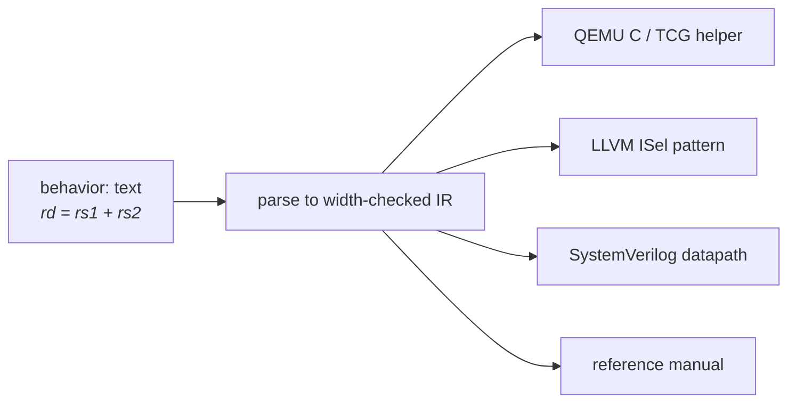

# The behavior DSL

Every instruction's semantics are one `behavior:` string in a small,
Python-syntax language. One definition drives all the generators: the QEMU
simulator, the LLVM compiler's instruction selection, the SystemVerilog
model, and the reference manual.



## Names

| Name | Refers to |
|---|---|
| schema field names (`rd`, `rs1`, `imm`, …) | registers (for `register`-role fields) or values (immediates) |
| `pc` | the program counter - assigning it makes the instruction a branch/jump |
| CSR names (`mstatus`), with field access (`mstatus.mie`) | control/status registers |
| any new name | a temporary, its width inferred from what you assign it |

## Operators

| Category | Operators |
|---|---|
| Arithmetic | `+  -  *  /  %` |
| Bitwise | `&  \|  ^  ~  <<  >>` |
| Comparison | `==  !=  <  <=  >  >=` |
| Boolean (in conditions) | `and  or` |

Two rules with teeth:

- `>>` is a **logical** shift. For an arithmetic (sign-preserving) shift,
  mark the value signed: `rd = signed(rs1) >> rs2[0:5]`.
- Comparisons are **unsigned** unless an operand is wrapped:
  `if signed(rs1) < signed(rs2): …` is the signed compare.

## Built-ins

| Builtin | Meaning |
|---|---|
| `sext(x, n)` | sign-extend the low `n` bits of `x` to the destination's width |
| `zext(x)` | zero-extend `x` to the destination's width |
| `signed(x)` | reinterpret as signed (changes `>>` and comparisons) |
| `mem8[a]` `mem16[a]` `mem32[a]` `mem64[a]` | memory access of that width - read on the right of `=`, write on the left |
| `range(n)` | loop bound, see control flow |
| `SomeOperand(a, b)` | construct an [Operand](types.md) value |

## Memory

```yaml
behavior: "rd = mem32[rs1 + imm]"            # load a word
behavior: "rd = sext(mem8[rs1 + imm], 8)"    # sign-extending byte load
behavior: "mem16[rs1 + imm] = rs2[0:16]"     # halfword store
```

Address expressions can be `base + immediate`, `base + register`, or a bare
register. The value width must match the access width - a 32-bit value into
`mem16[...]` is a generation error.

## Bit slices and concatenation

```yaml
behavior: "rd = rs1[16:32]"               # bits 16..31 (end-exclusive)
behavior: "rd = {rs2[0:16], rs1[0:16]}"   # concatenation, first item = MSBs
```

`{a, b, c}` builds a wider value left-to-right from most- to
least-significant; literal bits are allowed (`{imm, 0}` appends a zero bit).
This is how [split immediates](schemas.md#split-immediates) are reassembled:

```yaml
behavior: |
  if rs1 == rs2:
      pc = pc + sext({imm_12, imm_11, imm_10_5, imm_4_1, 0}, 13)
```

## Control flow

```yaml
behavior: |
  if signed(rs1) < signed(rs2):
      rd = 1
  else:
      rd = 0
```

```yaml
behavior: |
  for i in range(4):
      acc = acc + mem8[rs1 + i]
```

`if`/`elif`/`else` and `for … in range(...)` only. No `while`, no function
definitions, no recursion - anything else is a generation-time error naming
the instruction.

## Width discipline

Every expression has a known bit width, and assignments are checked:

```
Width mismatch: 'rd' is 32 bits but 'rs1_wide' evaluates to 64 bits
```

Fix with a slice (`rs1_wide[0:32]`) or an extension (`sext`/`zext`). A
top-level `sext(...)`/`zext(...)` adapts to whatever it's assigned into, so
extending into a wider register does the right thing.

## Cookbook

Real lines from the bundled examples, annotated:

```yaml
behavior: "rd = rs1 + rs2"                       # register ALU op
behavior: "rd = rs1 + imm"                       # immediate ALU op
behavior: "rd = zext(imm) << 12"                 # LUI-style upper immediate
behavior: "rd = mem32[rs1 + imm]"                # word load
behavior: "mem32[rs1 + {imm_11_5, imm_4_0}] = rs2"   # store w/ split offset
behavior: |                                      # compare into 0/1 (SLT-style)
  if signed(rs1) < signed(rs2):
      rd = 1
  else:
      rd = 0
behavior: |                                      # conditional branch
  if rs1 != rs2:
      pc = pc + sext({imm_12, imm_11, imm_10_5, imm_4_1, 0}, 13)
behavior: |                                      # jump-and-link
  rd = pc + 4
  pc = pc + sext({imm_20, imm_19_12, imm_11, imm_10_1, 0}, 21)
behavior: "vd = vs1 + vs2"                       # 128-bit add (npu-probe VADD)
behavior: |                                      # struct operand
  v = Vec2(rs1, rs2)
  rd = v.lo + v.hi
```

## What the compiler sees

The LLVM generator pattern-matches these shapes to build instruction
selection automatically - that's the role-inference layer described in
[compiler roles & coverage](../compiler/roles-and-coverage.md). A behavior
too unusual to match still simulates perfectly; the compiler lists it as
custom-lowered in `COMPILER_COVERAGE.md` with the reason.

## Current boundaries

- No `while`, user functions, or recursion (see Control flow).
- No trap/exception primitives, FP rounding-mode control, or atomic/ordered
  memory operations - instructions needing those can't be expressed yet.
- Memory accesses are 8–64 bits per access (wider values: compose two
  accesses with concatenation).
- Every unsupported construct is a loud generation error with the instruction
  named - if generation succeeded, the semantics you wrote are the semantics
  you get, in every generator.
